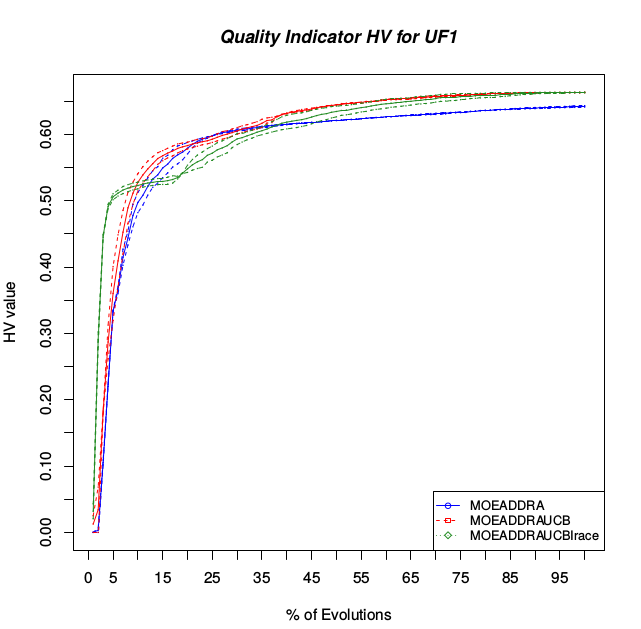

<html>
<h1> ExecuteJMetal </h1>
Bash Script to help statistical tests of Multi-Objective Evolutionary Algorithms. 
This Scripts use <a href="https://jmetal.github.io/jMetal/">JMetal Framework 5.2</a>. 
Only for Linux Users. 
Include another two experiment components for JMetal, see in source code in java. 

  1. Use the src in additional files to programming your JMetalMain 
 Look at the end of this files for more informations. 
  
  2. Install some programs 
	2.1. You need <b>LaTeX</b> - For .tex files 
<code>sudo apt-get install texlive-full</code> 
<code>sudo apt install texlive-latex-base</code> 
<code>sudo apt install texlive-generic-extra</code> 
<code>sudo apt-get install texlive-latex-extra</code> 
<code>sudo apt-get install texlive-science</code> 

   2.2. You need <b>R Language</b> - for .R files 
<code>sudo apt-get update</code> 
<code>sudo apt-get install r-base</code> 
<code>sudo apt-get install r-base-dev</code> 

   2.3. Install <a href="http://iridia.ulb.ac.be/irace/">Irace</a> 
     <code>R</code> 
       <code>R> install.packages("irace") </code> 

	2.4. Install <a href="https://cran.r-project.org/web/packages/scatterplot3d/index.html">Scatterplot3D</a>, used in new experiment components 
     <code>R</code> 
		<code>install.packages("scatterplot3d", repos="http://R-Forge.R-project.org") </code> 
	2.5. (optional) Install pdftk 
	<code>sudo apt-get install pdftk</code> 

  3. Configure Execute.sh 
    3.1. Set Benchmark 
    3.2. Set Algorithm and its Tag (tag is the name of data files) 
    3.3. Set Execution line 
    3.4. Set Comparative Line 
    
  4. Execute 
<code>sh Execute.sh</code> 

  5. Analyse the results in folder: experiment/MyExperiments/Result_$experimentName_$benchmark/

 
<b>In Additional Folder</b> 
<b>Script:</b> renameAll.sh 
Call the renameScript.sh for rename data files 
It be useful if you had old versions of JMetal and update, then,  
all of your data files will be for example "FUN.0", and the new versions use "FUN0.tsv" 
If you have this problem, set in this script algorithm and instance to rename. 
 
<b>Script:</b> renameScript.sh 
Rename All files in ".0 .1 .2  ...  .max" to ".tsv". 
 
 
<b>Source:</b> How to read input parameters to execute JMetal with this scripts. 
"MyRunner.java" is a single runner of algorithm configured by "Configuration.java" 
"ExecuteExperiment.java" can execute several runs and get all data for statistical test 
"Configuration.java" configure all tests, algorithms and benchmark 
"JMetalMain.java" read first argument to configure how it will execute  
<b>Example of execution: </b> 
<code>$ java -jar JMetal.java --statistic ZDT --algorithm NSGAII --algorithm MOEAD --tag test</code> 
It will execute NSGAII and MOEAD algorithm in benchmark ZDT, and MOEAD will save its data in "test" folder. 
 
<code>$ java -jar JMetal.java --single-run ZDT1 --algorithm MOEAD</code> 
It will execute MOEAD in ZDT1 instance and print the quality indicator at console. 
 
<code>$ java -jar JMetal.jar --comparative UF --algorithm MOEAD --algorithm MOEADDRA</code> 
It will generate latex and R files of statistical comparisons using  existing data files. 

 
<code>$ java -jar JMetal.jar --indicators UF --algorithm MOEAD</code> 
It will execute the indicators of existing data files. 

 
<b>Structure of tests</b> 
  <ul>
    <li>Execute.sh</li>
    <li>QualityIndicator.sh</li>
    <li>JMetal.jar <i>Put You'r compilation here</i></li>
    <li>Additional/ </li>
      <ul>
      <li>renameAll.sh</li>
      <li>renameScript.sh</li>
		</ul>
    <li>src/</li>
       <ul>
        <li>Configuration.java</li>
        <li>ExecuteExperiment.java</li>
        <li>JMetalMain.java</li>
        <li>MyRunner.java</li>
       </ul>
   <li>lib/ <i>Lib of you'r project</i></li>
	<li>irace/</li> <i>Irace example using you compilation</i>
   <li>experiment/</li>
    <ul>
      <li>MyExperiments/</li>
      <ul>
        <li>data/</li>
      </ul>
    </ul>
 </ul>
</html>

The "GenerateEvolutionChart.java" and "HistoryData.java" are the classes to generate this type of plot:
 
For use this module, you need follow this steps: 
<ul>
	<li>In your algorithm: implement "HistoricAlgorithm", for example look MOEADDRA in this src files;</li>
	<ul>
		<li>Add an Map of "String" to "HistoryData" and add the classes for each indicators;</li>
	</ul>
	<li>At each evaluation test and calculate the quality indicator;</li>	
	<ul>
		<li>You can use the static methods of "HistoricAlgorithm", only call this methos like the implementation in MOEADDRA in this src;</li>
	</ul>
	<li>At final, Print Historic data, for example look "ExecuteExperiment"</li>
	<li>Generate Rscript with "GenerateEvolutionChart"</li>
</ul>
<i>Obs.: Run it before the run of other Experiment Components (generate of tables and scripts) because these components can modify the experiment algorithm, then you should have an exception;</i>

